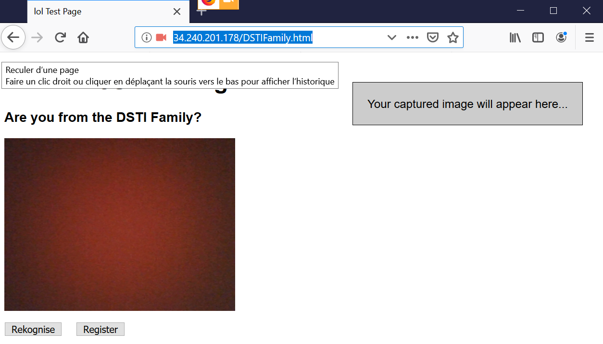
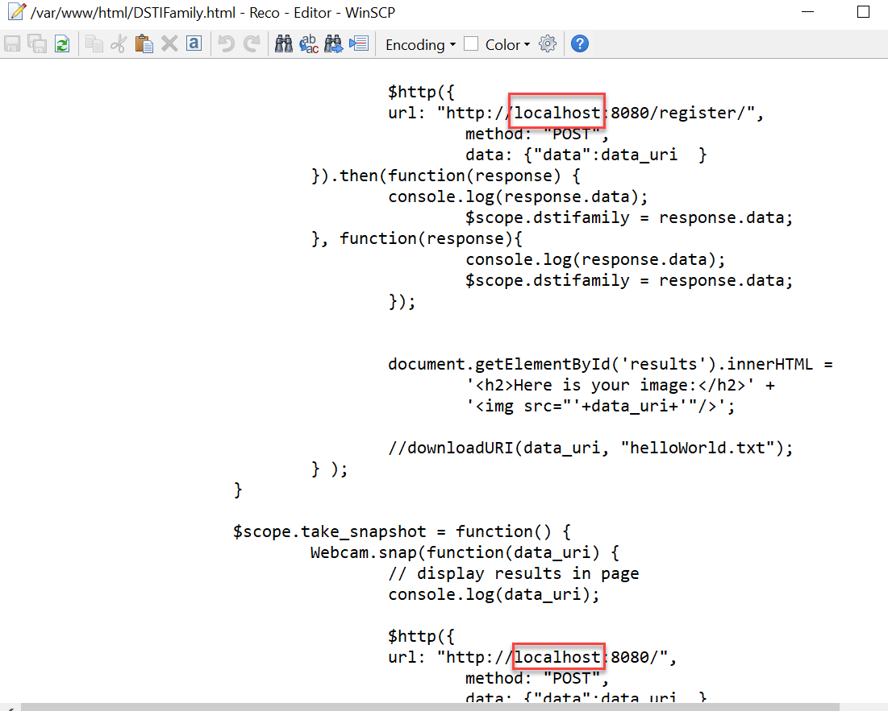
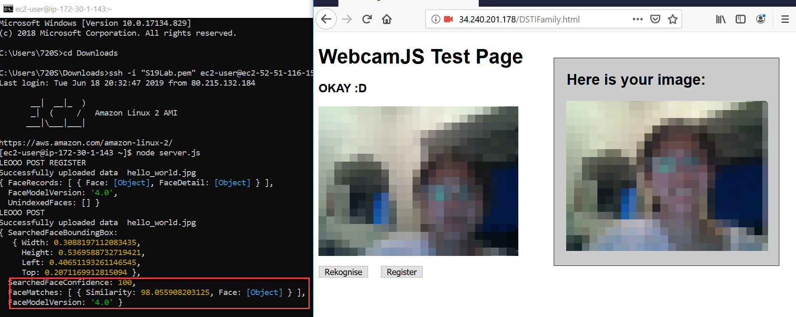

# Introduction:

We are going to build a small web application for facial recognition using AWS.

## Step 1: Download essential file in documents folder

* DSTIFamily.html
* package.json
* server.js
* webcam.min.js
 
## Step 2: build EC2 instances

We will build 2 instance (Linux) on AWS EC2: Web server (front end) and app server(backend).

1. Web server instance: apache

* Open auto assign public IP
* Add security group `Ports=80`, `Protocal= tpc`, `Source= ::/0`

2. App server instance: Node.Js

* Open auto assign public IP (here for the convenience, we put it to the public subnet, in practice don’t do this)
* Add security group `Ports=8080`, `Protocal= tpc`, `Source= ::/0`
 
## Step 3: Set Web Server (front end)

1. Run below code:

```
sudo yum update -y	                    	#Update the list of the available software
sudo yum -y install httpd    	          	#Answer yes to any question
                                          #Httpd: the package that runs Apache
sudo service httpd start       	        	#Start the servcie
sudo service httpd status     	        	#Check if its working
```
*(now go to your public ip address from the browser, you should see Test page of Apache)*
 
2. Try to launch simple html web page
 
* On the instance type ` echo “this is sandy” >>sandy.html `
* Put this file under `/var/www/html` by typing `sudo mv sandy.html /var/www/html `
* Open this link to your browser `<your web server public ip>/sandy.html` 
* you should see on your browser “this is sandy”

3. Launch web user interface

* Open [WinSCP](https://winscp.net/eng/docs/guide_amazon_ec2)
* Put `DSTIFamily.html` and `webcam.min.js` into the instance
* either directly under /var/www/html or write command `sudo mv DSTIFamily.html /var/www/html` , `sudo mv webcam.min.js /var/www/html`
* Now open `<your web server public IP>/DSTIFamily.html` you should see the interface



*note that if you don’t see the camera, try it on firefox*

4. Change DSTIFamily.html configuration
* go to directory `/var/www/html`
* open file editor by command `sudo vi DSTIFamil.html`: change the 2 `localhost` to `<public ip adress of your App server>` (or change in the WinSCP directly) 



## Step 4: Set App Server (back end)

1.  Put `server.js` and `package.json` into App Server instance

* Using WinSCP to put the file on the server instance directly

2. Run below code on your instance

```
sudo yum update -y	                    	#Update the list of the available software
curl --silent --location https://rpm.nodesource.com/setup_10.x | sudo bash -
sudo yum -y install nodejs
npm install 				#Check the pasckage.json and install dependencies
node server.js 				#Run node server.js
```

3. Test if server.js is working

* Leave the command running
* On the browser type `<your app server ip>:8080` if you see `LEOOO GET` on the command prompt (App Server) means it is working

## Step 5: See final result

* On your app server command, run `node server.js`
* Open your browser `<web server ip>/DSTIFamily.html`
* Press Register to take yourself a picture
* Press Rekognise to see the similarity on your prompt (App Server)



*(note nodejs bug, if we have error running ` node server.js` then use the command  `killall -9 node` to clear the running server.js and rerun `node server.js` again)* 

