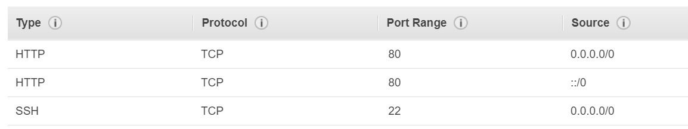
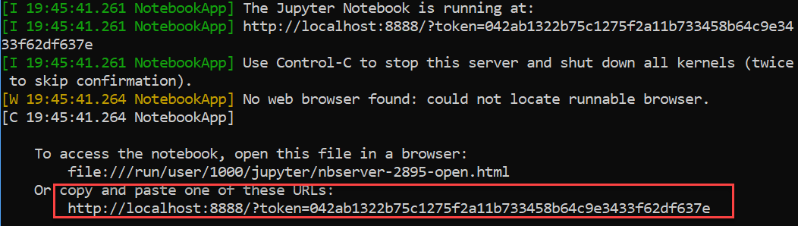
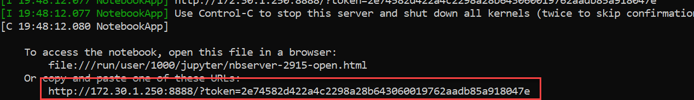
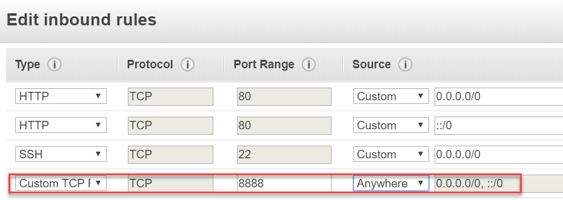
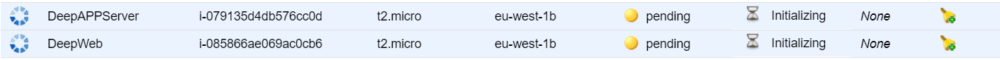
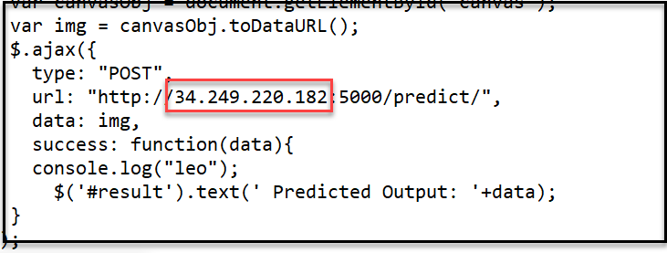
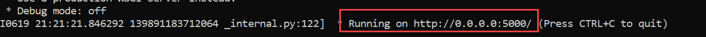

# Introduction

We are going to launch a small MNIST model on the web that the website can recognize the number written, the main topic would be in the follow:

* Launch Jupyter Notebook to get a trained model

* Launch a web application link to the server
 
# Launch Jupyter Notebook

We are going to launch a jupyter notebook to train our model, there are 2 ways to do it

* Use AMI

* Launch an Ubuntu instance, then install anaconda (python 3.7) on top

Here we present the 2nd way

## Step 1: Launch a Ubuntu instance: 

`memory: 8Gib`, `storage: 30 Gib`, `open security group for http`



## Step 2: Instance configuration

Visit Anaconda’s download page and right click to get the url of the latest version of the Linux 64-bit version. Start with below command (note that we should use Python 3.6 to train our model, but we can still download anaconda python 3.7).

1. Connect to your instance

2. Download anaconda: `wget https://repo.anaconda.com/archive/Anaconda3-2019.03-Linux-x86_64.sh `

3. Install anaconda: `bash Anaconda3-2019.03-Linux-x86_64.sh` (with many enter and one yes, be sure the last initialize part should be yes, if you don’t put yes, they would choose false for you )

4. Try to type `conda`, if it is not found try `source .bashrc` or `Export PATH=~/anaconda3/bin:$PATH ` (we can check the `.bashrc` file by `cat .bashrc`)

## Step 3: jupyter notebook configuration

1. Try to type `jupyter notebook` and open your public ip in the browser (now we see that the we cannot yet link to our jupyter notbook from browser, that is we need to change the configuration)



2. Generate a configuration file ` jupyter notebook --generate-config`

3. launch the jupyter notebook with ip changes ` jupyter notebook --ip=172.30.1.250 --no-browser ` (use your private ip, that it recognize by the server)



4. now you get a new link to put in the browser, but we need to change the ip address to `<your instance public ip>`

5. As you see the port 8888 is open, that is the security group should open port 8888 in EC2



 6. Now you should be able to access your jupyter notebook with http://34.245.204.32:8888/tree

## Step 4: train your MNIST model

1. Download the `9.png` and `00-mnist-cnn.ipynb` files in the documents folder and upload it to your jupyter notebook.

2. In your instance run the below command (with all the package needed)
```
conda info		#get the idea of the current python version (now is 3.7, but we need 3.6 to train the model

conda install nb_conda

conda create -n myenv-p36 python=3.6
conda activate myenv-p36		#change your environment

conda install ipykernel
ipython kernel install --user --name=python-36

conda install keras
conda install opencv
```


3. Open the `00-mnist-cnn.ipynb` 

4. From Kernal change kernal to the python-36 that was just created

5. Run the code to get the `cnn-mnist` file

6. Once we have the model, we can either stop or terminate the instance

# Set up web infrastructure

## Step 1: create 2 EC2 instances

1. (basic)Linux instance: Web server for front end (with HTTP firewall open: port 80)
2. (basic)Ubuntu instance: App server for backend 



## Step 2: Setup web server (Front end)
 
1. Connect to your web server

2. Download `static` folder and `index.html` file and place them under `/var/www/html` 

* use WinSCP to put these 2 files into the instance 
* use command to move them `sudo mv <filename> /var/www/html`

3. Run below code:
```
sudo yum update -y	                    	#Update the list of the available software
sudo yum -y install httpd    	        	#Answer yes to any question
#Httpd: the package that runs Apache
sudo service httpd start       	        	#Start the servcie
sudo service httpd status     	        	#Check if its working
```
4. Open your browser with `<your web server public ip>/index.html` you will see your web page displaying

5. Change the `index.html` file IP to link both instance: change it to your app server’s public IP


 
 ## Step 3: Setup App server (back end)

1. Connect to your App server

2. Download `9.png` and `keras_flask.py` from Documents and use WinSCP to put both files plus `cnn-mnist` trained model into App server

(or you can run the command `git clone <url>` to download everything from the url and take the file that is needed)

3. Set up the environment by running the below command
```
sudo apt-get update
sudo apt install python3-pip
```

4. Download packages

```
pip3 install scipy==1.1.0 --user
sudo pip3 install flask
sudo pip3 install imageio
sudo pip3 install keras
sudo pip3 install tensorflow
sudo pip3 install flask_cors
--sudo pip3 install opencv-python
```

6. Run the python code (note that the trained model should be on the same directory): `python3 keras_flask.py`



7. Above image shown that we need to modify the security group (App server): add port 5000


# Result

1. Run `python3 keras_flask.py`
2. Open your web to predict and see the result


Reference: https://github.com/leodsti/AWS_Tutorials/tree/master/MNIST


