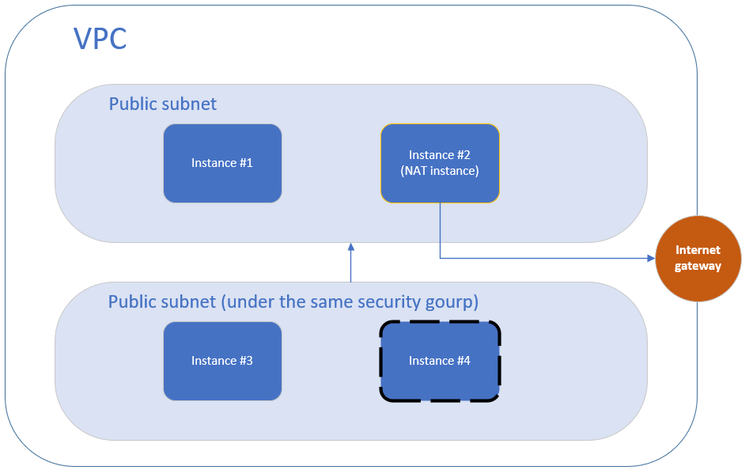
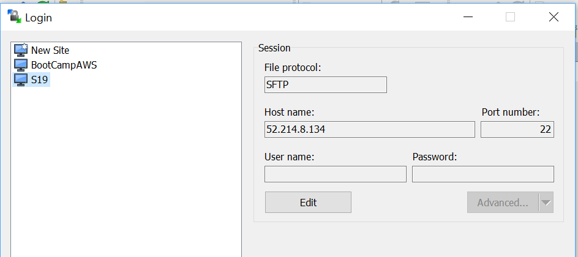
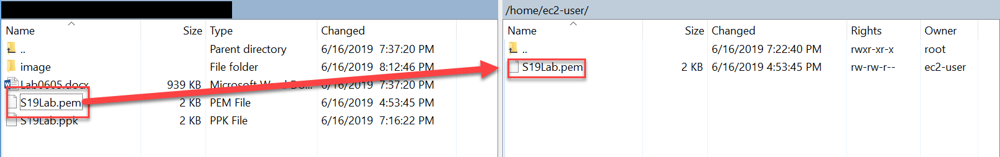
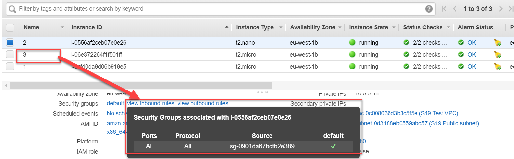
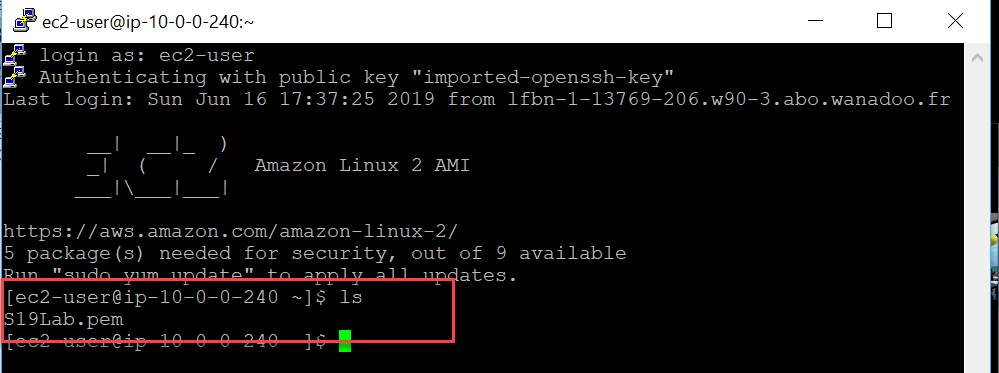
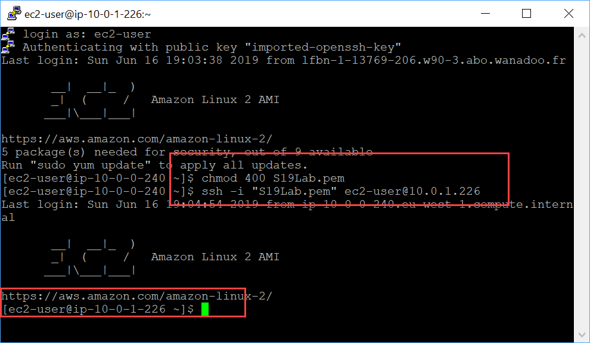
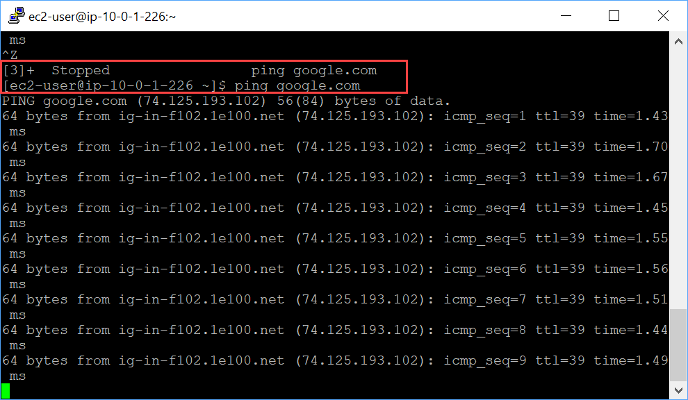

Reference link: https://docs.aws.amazon.com/vpc/latest/userguide/VPC_Scenario2.html

# Introduction
This exercise is to create a simple architecture on AWS, using 1 VPC with public and private subnet.

We want to make the instance (#3) in the private subnet able to reach to the internet on google.com for example.

## Step 1: Create Key Pair 
* In EC2: Create EC2 Key pair for the NAT instance to use.

## Step 2: launch VPC
* In VPC: Using VPC Wizard

* Select VPC with public and private subnet

* Specify the NAT instance with the pre-created key pair

* Now in **EC2** we can see NAT instance sucessfully created (instance #2)

## Step 3: Create EC2 instances 
Create 2 instances under private and public subnet, under the VPC we’ve created
* Public:
1. Subnet choose the public subnet
2. Enable auto-assign public IP 
* Private:
1. Same procedure as Public
2. But subnet choose the private subnet

Launch and choose the key pair I’ve created

## Step 4: Convert .pem pair key to .ppk 
Using puttygen to transform the key from .pem (amazon provided) to .ppk

Load and import our key: S19Lab.pem -> save private key

 
 
Open PuTTy.exe

Get the public address from our instance #3

Check the security group ports

Go to auth and load the keypair .bbk that we have generated

Then open PuTTY
* Login as `ec2-user`

*Here we ping google.com, we can connect to the internet*

## Step 5: Allow instance #1 to reach to instance #3
Go to the security group of the private subnet instance (instance #3) and add inbound rule

**All ICMP-IPv4 select the security group of the instance #1**

*As a result now in the public instance #1 we can reach to instance #3 by its private IP address*

## Step 6: Copy private key on Public #1
Using WinSCP to login the instance 1

Then put the key pair up to the public EC2 instance
 

 
## Step 7: check NAT (instance 2) security group inbound rule
Be sure the NAT inbound rule source should be from our instance #3, allowing instance #3 from the private subnet to reach.

## Step 8: Connect the instances
* Choose the private instance (instance #3) and press connect
* -We see the command line on the instruction to type on PuTTY  (of instance #1)
1. ‘chmod 400 S19Lab.pem’
2. ‘ssh -i "S19Lab.pem" ec2-user@10.0.1.226’

*now we can reach private subnet instance #3 from public subnet instance #1*

## Conclude: Ping google.com from instance #3
Since now we are on instance #3, we can reach our target: 
**To ping google.com from instance #3**

## Extension 

* Create another instance #4 under private subnet, with the same security group as instance #3, it can also ping google.com (as NAT has set the inbound security group)

* Clean the environment: when we don’t need the environment anymore it is better to clear everything we are not using anymore
1. Terminate all instances, security group (VPC can be left undeleted, no extra charges requires
2. Release also the auto-assigned IP 
