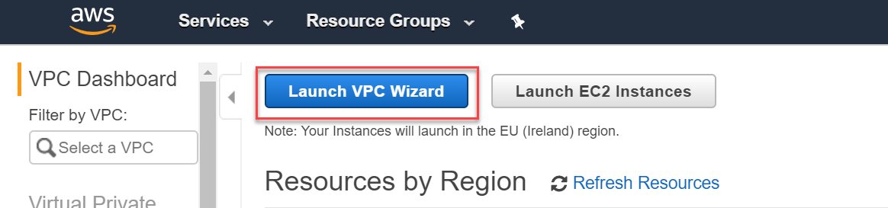
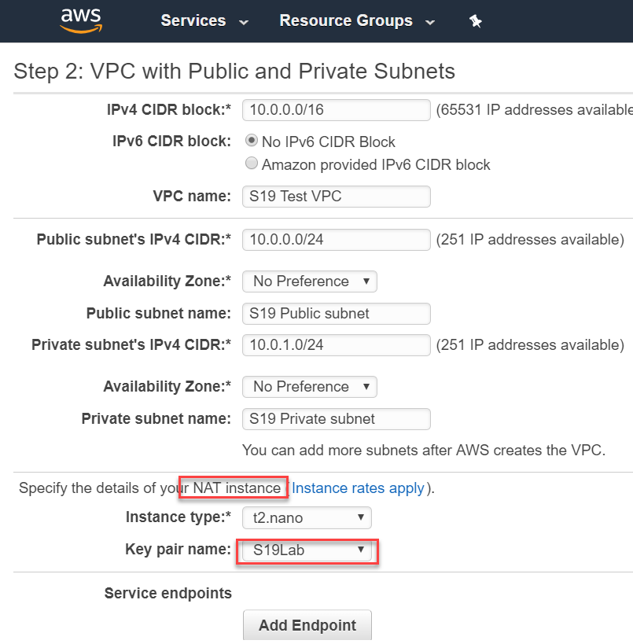
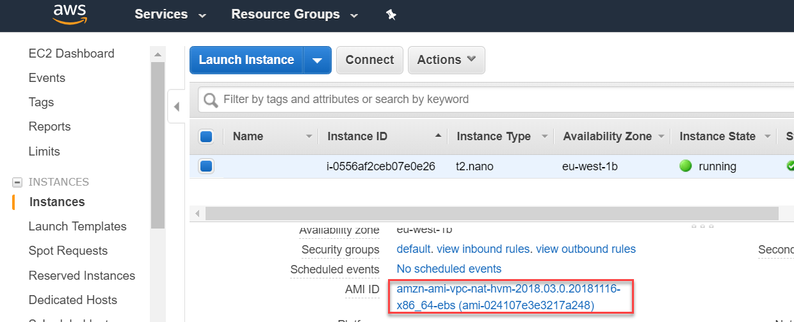
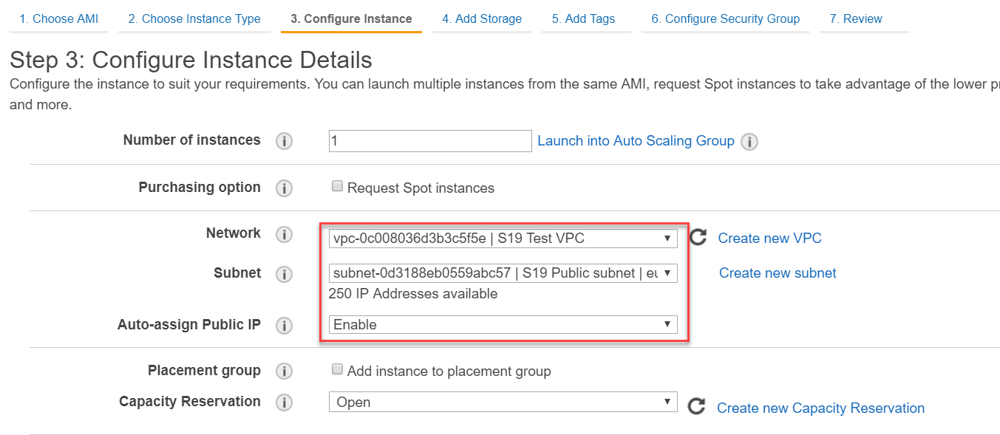
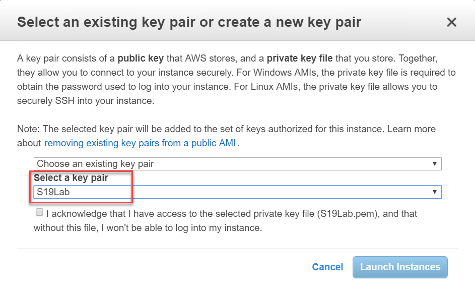
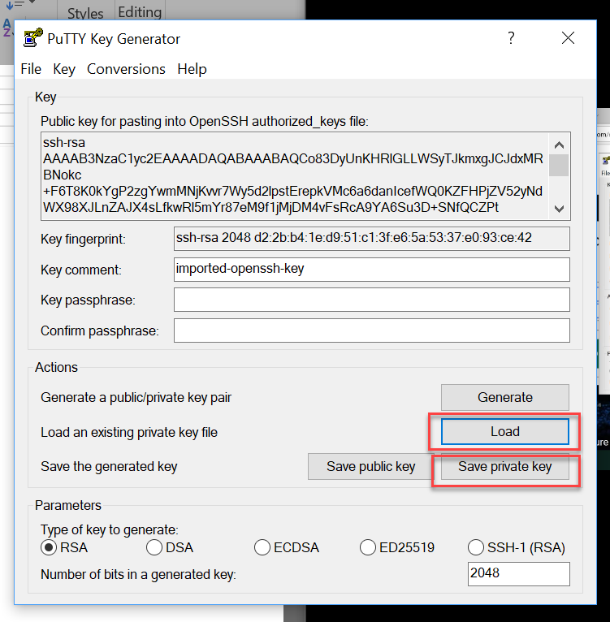
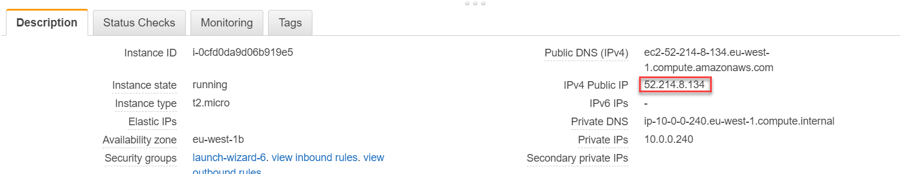
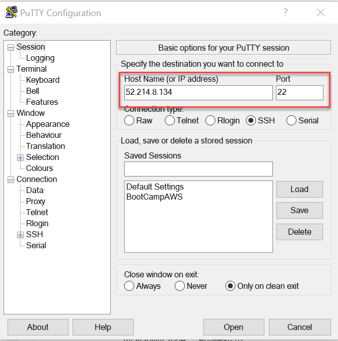
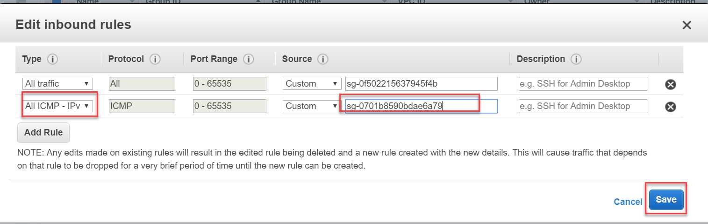

Reference link: https://docs.aws.amazon.com/vpc/latest/userguide/VPC_Scenario2.html

# Introduction
This exercise is to create a simple architecture on AWS, using 1 VPC with public and private subnet.

We want to make the instance (#3) in the private subnet able to reach to the internet on google.com for example.

## Step 1: Create Key Pair 
* In EC2: Create EC2 Key pair for the NAT instance to use.

## Step 2: launch VPC
* In VPC: Using VPC Wizard

* Select VPC with public and private subnet

* Specify the NAT instance with the pre-created key pair

* Now in **EC2** we can see NAT instance sucessfully created (instance #2)

## Step 3: Create EC2 instances 
Create 2 instances under private and public subnet, under the VPC we’ve created
* Public:
1. Subnet choose the public subnet
2. Enable auto-assign public IP 
* Private:
1. Same procedure as Public
2. But subnet choose the private subnet

Launch and choose the key pair I’ve created

## Step 4: Convert .pem pair key to .ppk 
Using puttygen to transform the key from .pem (amazon provided) to .ppk

Load and import our key: S19Lab.pem -> save private key

 
 
Open PuTTy.exe

Get the public address from our instance #3

Check the security group ports

Go to auth and load the keypair .bbk that we have generated

Then open PuTTY
* Login as `ec2-user`

*Here we ping google.com, we can connect to the internet*

## Step 5: Connect instance 
Go to the security group of the private subnet instance (instance #3) and add inbound rule 
**All ICMP-IPv4 select the security group of the instance #1 **

*As a result now in the public instance #1 we can reach to instance #3 by its private IP address*

