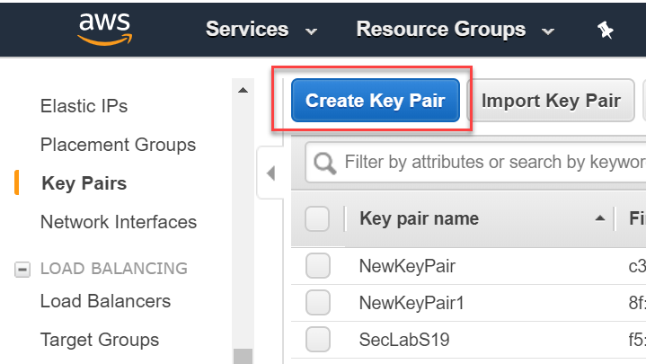

Reference link: https://docs.aws.amazon.com/vpc/latest/userguide/VPC_Scenario2.html

# Introduction
This exercise is to create a simple architecture on AWS, using 1 VPC with public and private subnet.

We want to make the instance (#3) in the private subnet able to reach to the internet on google.com for example.

## Step 1: Create Key Pair 
In EC2: Create EC2 Key pair for the NAT instance to use.

