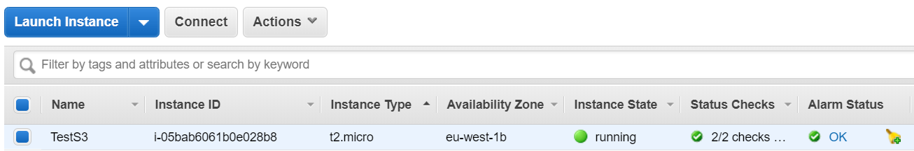
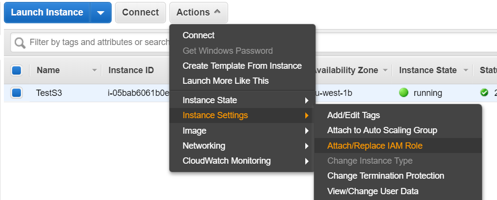
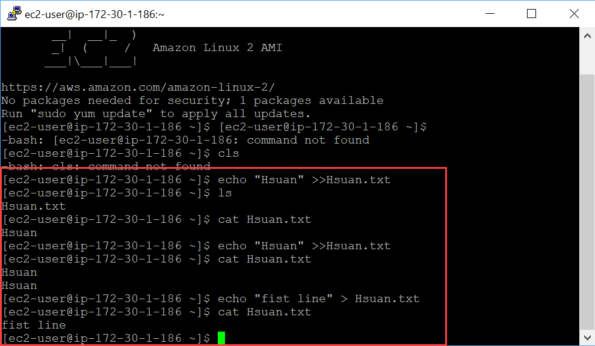
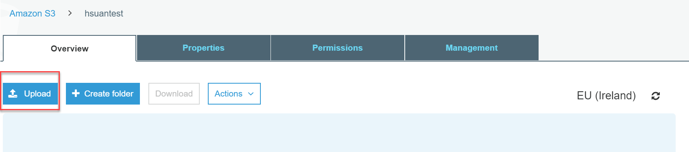
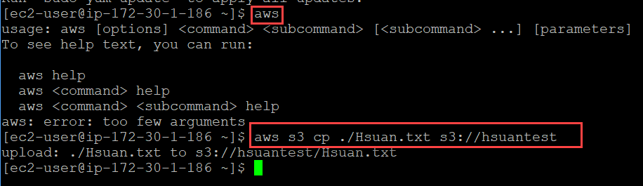
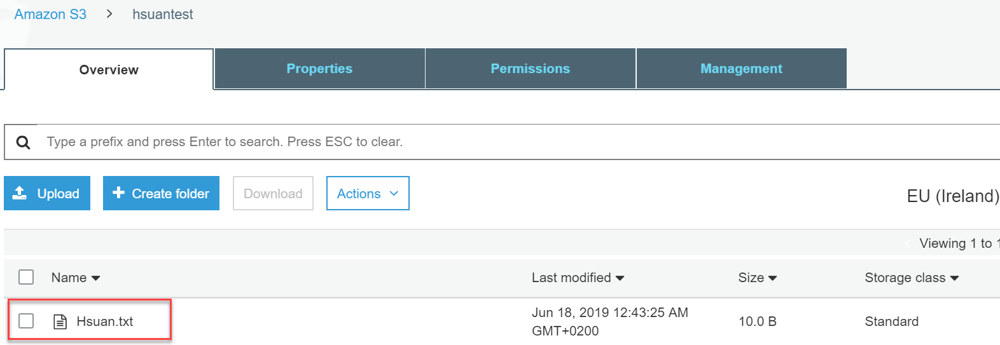

# Push file from EC2 to S3
## Step 1: Launch a Linus AWS instance

## Step 2: Assign instance to IAM role
Create an IAM role allowing EC2 to connect to S3 **(EC2 to S3 full access)**

## Step 3: Create a txt file on the instance

* Once I login to my instance type `echo “Hsuan” >> Hsuan.txt`
* File is created

 

## Step 4: Create a bucket on S3
* Note that the bucket name is unique across internet
* Choose the same region as the instance

 

## Step 5: Push file to S3

* Two ways of doing it:
	
1. upload directly from the bucket

 
2. From Linux instance to push, enter below code

      `aws`

      `aws s3 cp  <source> s3://<nameofyourbucket>`

 
## Step 6: check if the file is up to S3

 
# Download file from S3 to EC2 instance

## Step 1: remove the file from the instance

With the command `rm Hsuan.txt`

## Step 2: write the code on the instance to download file

`aws s3 cp s3://hsuantest/Hsuan.txt .`

